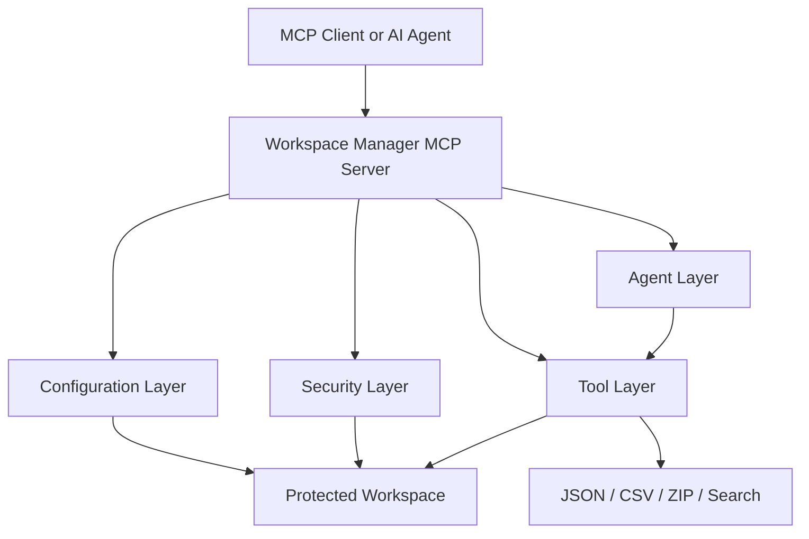

# Workspace Manager MCP

Workspace Manager MCP is a secure, modular Python MCP server for creating, organizing, editing, and managing AI projects inside a dedicated workspace directory. It is designed as a safe, policy-driven workspace assistant rather than a general-purpose file browser.

The project exists to give AI agents and developers a controlled place to build projects, create files, organize data, and scaffold starter content without exposing the host machine to unsafe file operations. All interactions stay inside a protected workspace root and reject paths that try to escape it. The implementation is intentionally layered so agents, tools, security rules, and configuration can evolve independently as the project grows.

## Why this project exists

This server is useful when you want an AI workflow that can:
- create and manage project folders safely
- generate documentation, datasets, and starter files automatically
- work with JSON, CSV, and archive data in a controlled environment
- expose a clean interface for future MCP clients and automation tools
- support repeatable developer tasks without opening unrestricted file access to the whole machine

It is especially helpful for local experimentation, prototyping, and building AI-assisted developer workflows where file access needs to be predictable, auditable, and contained. In short, the project turns a normal filesystem into a controlled workspace that an AI agent can use responsibly.

## How the project works

The project follows a simple but effective pattern:
1. A configuration layer defines the workspace root and runtime defaults.
2. A security layer validates every path before it is used.
3. Agent modules interpret higher-level requests such as “create a project” or “build a dataset.”
4. Tool modules perform the concrete filesystem and data operations.
5. The MCP server exposes these capabilities through a clean interface that can be consumed by other tools or assistants.

This separation makes the system easier to maintain and easier to extend with more features later.

## What the project includes

### Project and workspace management
- Create, list, and remove projects
- Create and manage folders and files inside each project
- Read, write, append, copy, and delete files safely within the workspace

### Structured data tools
- Read and write JSON files
- Create, append, read, and inspect CSV files
- Search for files or content across the workspace
- Create and extract ZIP archives for simple backup and packaging workflows

### Planning and automation support
- Interpret natural-language prompts such as “create a React app” or “create a YOLO project”
- Return a structured plan for the requested workflow
- Support expansion for more complex planning and agent-driven actions

### Dataset and template support
- Generate dataset folder structures for common ML tasks
- Provide starter template ideas for Python, React, FastAPI, AI, YOLO, research, and documentation projects

### Security model
- Restricts all file system access to a dedicated workspace directory
- Blocks path traversal and directory escape attempts
- Rejects unsafe names and disallowed system locations
- Uses centralized validation before any write or read operation

## Local installation

Follow these steps in order to set up the project on your machine.

### 1. Prerequisites
Make sure you have Python 3.10+ installed and available in your terminal.

Check your installation with:
```bash
python --version
pip --version
```

If Python is not installed, download it from the official Python website and make sure the installer adds Python to your PATH.

### 2. Open the project folder
```bash
cd /path/to/your/workspace
git clone <your-repo-url>
cd workspace-manager-mcp
```

### 3. Create a virtual environment
A virtual environment keeps the project dependencies isolated from the rest of your system.

On Windows (PowerShell):
```powershell
py -3.10 -m venv .venv
.venv\Scripts\Activate.ps1
```

If PowerShell blocks the activation script, run this once in the same terminal:
```powershell
Set-ExecutionPolicy -Scope Process Bypass
```

On macOS/Linux:
```bash
python3 -m venv .venv
source .venv/bin/activate
```

### 4. Upgrade pip and install dependencies
```bash
python -m pip install --upgrade pip
pip install -e .[dev]
```

This installs the package in editable mode so local code changes are picked up immediately.

### 5. Verify the installation
Run the test suite to confirm everything is working:
```bash
python -m pytest -q
```

You should see the tests complete successfully.

### 6. Start the server
```bash
python -m workspace_manager.server
```

If you are using the project as an MCP server, this is the standard entry point for local execution.

### 7. Optional: use the package from Python
You can also import and test it directly in Python:
```bash
python -c "from workspace_manager.server import create_server; print(create_server())"
```

## Example usage

### Create a server instance
```python
from workspace_manager.server import create_server

server = create_server()
print(server)
```

### Typical workflow
A common flow is to create a project, add a few files, and then save structured data or a small archive for sharing:
```python
from workspace_manager.agents.workspace_agent import WorkspaceAgent
from workspace_manager.models import WorkspaceConfig
from workspace_manager.security import SecurityGuard
from workspace_manager.utils.logger import WorkspaceLogger
from workspace_manager.tools.file_tools import FileTools
from workspace_manager.tools.zip_tools import ZipTools

config = WorkspaceConfig(workspace_root="workspace")
agent = WorkspaceAgent(config, SecurityGuard(config.resolve_workspace_root()), WorkspaceLogger())
file_tools = FileTools(workspace_root="workspace")
zip_tools = ZipTools(workspace_root="workspace")

agent.create_project("demo")
agent.create_file("demo/README.md", "Hello from Workspace Manager MCP")
file_tools.create_file("demo/notes.txt", "Project created")
zip_tools.compress_folder("demo")
```

### Use the workspace agent directly
```python
from workspace_manager.agents.workspace_agent import WorkspaceAgent
from workspace_manager.models import WorkspaceConfig
from workspace_manager.security import SecurityGuard
from workspace_manager.utils.logger import WorkspaceLogger

config = WorkspaceConfig(workspace_root="workspace")
agent = WorkspaceAgent(config, SecurityGuard(config.resolve_workspace_root()), WorkspaceLogger())
agent.create_project("demo")
agent.create_file("demo/README.md", "Hello from Workspace Manager MCP")
```

### Use the file and archive helpers
```python
from workspace_manager.tools.file_tools import FileTools
from workspace_manager.tools.zip_tools import ZipTools

workspace = "."
file_tools = FileTools(workspace_root=workspace)
zip_tools = ZipTools(workspace_root=workspace)

file_tools.create_file("notes.txt", "hello")
file_tools.append_file("notes.txt", " world")
zip_tools.compress_folder(".")
```

## Configuration
The project uses a TOML configuration file named config.toml. You can change the workspace root, logging level, allowed extensions, and template directory there. A typical configuration change is to point the workspace root to a different folder when you want the server to manage a different local project area.

## Testing
Run the tests locally with:
```bash
python -m pytest -q
```

## Project structure
- src/workspace_manager: main package
- src/workspace_manager/agents: planner, workspace, template, dataset, and documentation agents
- src/workspace_manager/tools: JSON, CSV, search, file, and ZIP helpers
- tests: pytest coverage for safe workspace behavior and core tool operations
- docs: architecture notes and usage guidance
- config.toml: runtime configuration for workspace root and defaults

## Full architecture overview

The project is structured around a layered architecture that keeps responsibilities clearly separated:

- Config layer: loads runtime settings from config.toml and creates the workspace configuration object.
- Security layer: enforces path safety, workspace boundaries, and safe naming rules before any operation is performed.
- Agent layer: contains higher-level behavior such as workspace management, planning, dataset scaffolding, templates, and documentation support.
- Tool layer: performs concrete operations like file creation, JSON/CSV handling, search, and ZIP archive management.
- Server layer: registers the available MCP tools and exposes them through the main entry point.

This design makes the codebase easier to understand because each component has a focused role. For example, the security layer protects the file system, while the workspace agent decides what should be created, and the tool modules carry out the implementation details.

### Architecture diagram


### Module responsibilities
- WorkspaceAgent: creates projects, folders, and files inside the allowed workspace.
- PlannerAgent: interprets natural-language prompts and produces structured intents.
- TemplateAgent: suggests starter templates for common project types.
- DatasetAgent: creates folder structures and documentation for machine-learning or data-oriented projects.
- DocumentationAgent: supports documentation scaffolding for projects.
- FileTools / ZipTools: handle file creation, copying, appending, and archive creation.
- JsonTools / CsvTools: manage structured data workflows.
- SearchTools: locate files and content across the workspace.

## Development notes
If you want to extend the project, the easiest places to start are:
- adding new agent behaviors in the agent modules
- introducing new tool modules for additional file formats or automation tasks
- expanding the validation rules in the security layer
- adding new tests whenever a new workflow is added
- improving the planner to understand more complex prompts and produce richer plans

## Next steps
This project is now a solid foundation for a secure AI workspace manager. It is ready for further extension with richer templates, semantic search, metadata inspection, more advanced planning behavior, and deeper automation-oriented agents.
